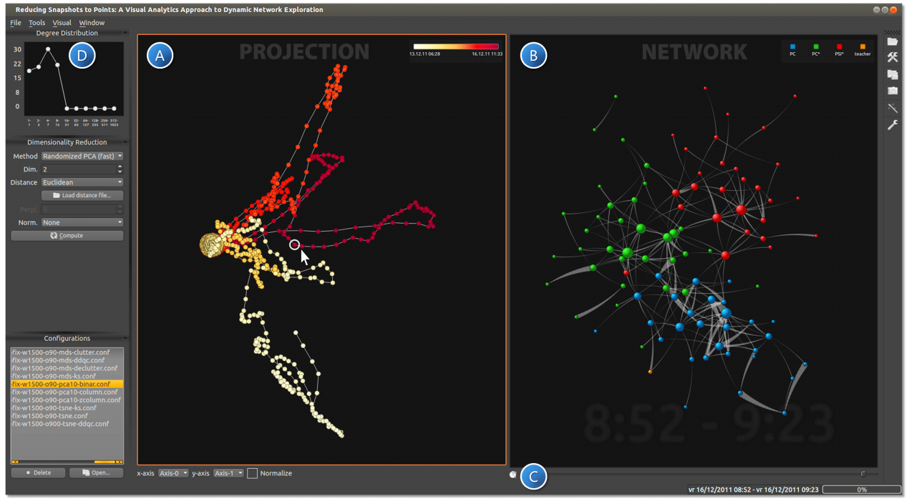
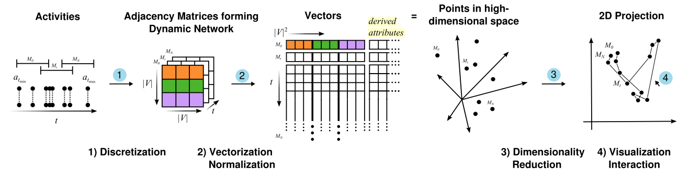

# 浙江大学可视分析小组新人培训项目

> 如果要在本地打开此文件，推荐使用typora打开

## 作业要求

> 各位同学在上课前，可以看一下[作业指南](#作业指南)，做一下准备工作
>
> 下面的要求都是对于大一本科生的要求，各位同学的要求是，使用任意一种前端框架（react/vue/angular）实现以下功能，并且带有后端（推荐python）的数据接口，如果你想使用react+antd+eslint+prettier...推荐你去clone这个项目（打一波广告：[create-react-antd-vis-app](https://github.com/JackieAnxis/Create-React-Antd-Vis-App)），并在此基础上进行开发

1. 实现Reducing Snapshots to Points: A Visual Analytics Approach to Dynamic Network Exploration的可视化界面，实现下图中A B D部分，并完成如下功能：

   

   - 将动态图投影到A面板内
   - 点击A面板内的某个点，可以在B中展示这个点对应的一个图结构
   - 能够在D中展示上面选中的图结构的度（degree）分布
     
     - 度（degree）的概念，如果一个节点连着N条边，那么这个节点的度就是N
     
     - 加入颜色编码（包括A图中，使用时间信息来编码；B图中用班级信息来编码）
  - B视图中，网络中的边的粗细能根据其权重进行变化（权重越高，说明该时间段内这两个人联系越多，不要求使用曲线边，也不要求区分方向）


2. 阅读Reducing Snapshots to Points: A Visual Analytics Approach to Dynamic Network Exploration，复现其中关于如何将动态图转化为二维平面坐标的算法（在本目录下有PDF，有相关的中文博客解释这篇论文：[浙江大学可视分析小组博客](https://zjuvag.org/blog/2015/10/29/2015-10-29-Reducing-Snapshots-to-Points-A-Visual-Analytics-Approach-to-Dynamic-Network-Exploration/)）

   

   下面是对算法的最基础的要求：

   1. 读取数据源文件；
   2. 按照0分钟-60分钟，6分钟-66分钟，…；每60分钟为一帧，前后两帧有54分钟的重叠这样的规律去构建动态图；每一帧应该包括所有的节点（180个）；
   3. 利用networkx的算法，生成邻接矩阵（注意这些邻接矩阵应该是180\*180的）
   4. 将邻接矩阵拼接成一个高维向量（180\*180=32400维），拼接方法如上图（2）
   5. 用sklearn包里面的t-SNE算法，PCA算法对这些高维向量进行降维（每一个高维向量变成一个二维向量，希望各位简单去了解一下降维过程到底发生了什么？）
   6. 将这些动态图、二维向量以及动态图每一帧的度数分布保存下来

   > 当然，你也可以放弃这部分的分数，选择我们提供的算法和生成好的数据（在本目录下的`backend.zip`中，可以联系助教获取解压密码；
   
3. 文章的数据集来源：[DATASET: High school dynamic contact networks](http://www.sociopatterns.org/datasets/high-school-dynamic-contact-networks/)，选择2012年的数据；或者直接使用这里提供的[thiers_20912.csv](./thiers_20912.csv)。

4. 当然可以用其他的数据集来代替该数据，推荐数据集

   - <http://konect.uni-koblenz.de/>
   - <http://networkrepository.com/>
   - <https://snap.stanford.edu/data/index.html>


## 作业指南

1. 准备工作

      - 编辑器：[Visual Studio Code](https://code.visualstudio.com/)（推荐，可以选择其他编辑器）
      - 浏览器：Chrome（推荐，可以选择其他浏览器）
      - 版本管理+协同合作工具：[Git](https://git-scm.com/downloads)+[Github](http://github.com)（推荐，Git相关教程：[廖雪峰的Git教程](https://www.liaoxuefeng.com/wiki/896043488029600
        )）
      - [Node.js](https://nodejs.org/zh-cn/)，推荐安装
      - [Python](https://www.python.org/downloads/)，推荐安装，版本3，64位（请安装64位版本的python，32位的安装包会有内存问题）

      > Windows用户在安装好Nodejs和python后，不要忘记添加环境变量哦
      >
      > python安装方法：https://www.runoob.com/python/python-install.html
      >
      > nodejs安装方法：<https://www.jianshu.com/p/2d9fa3659645>

      > 如果你没有科学上网，那么建议你在开发前进行换源；
      >
      > pip换源：[Windows](https://blog.csdn.net/Artprog/article/details/75632723)，[MacOS](https://www.jianshu.com/p/f771e1120003)
      >
      > [npm换源](https://www.jianshu.com/p/f311a3a155ff)

2. 后端开发：

      - [Pycharm](https://www.jetbrains.com/pycharm/)：python的IDE，使用ZJU邮箱可以免费注册使用

      - 你可能需要用到的库（安装时如果报错，请尝试用管理员权限：windows用户就是管理员权限打开行命令，macOS就是在命令前加上`sudo`）
        ```
        pip install networkx scipy sklearn
        ```

        - networkx用于处理图数据
        - scipy+networkx用于生成矩阵
        - sklearn的PCA和TSNE等用于进行降维

3. 前端开发
   1. 要求使用任意一种前端框架（react/vue/angular）实现以下功能
   2. 推荐（个人广告）：react+antd+eslint+prettier，clone这个项目（打一波广告：[create-react-antd-vis-app](https://github.com/JackieAnxis/Create-React-Antd-Vis-App)），并在此基础上进行开发；react学习：[react小书](http://huziketang.mangojuice.top/books/react/)
